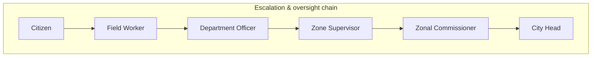
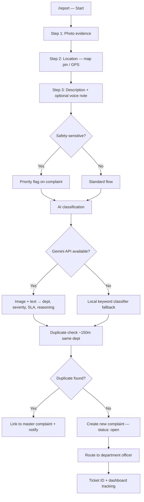
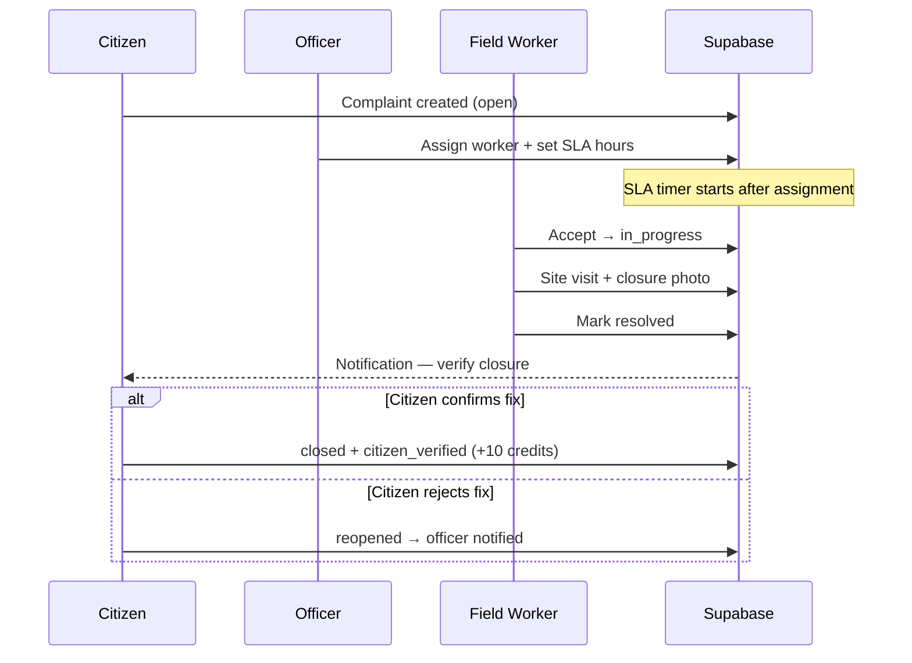
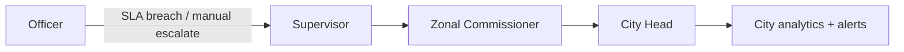
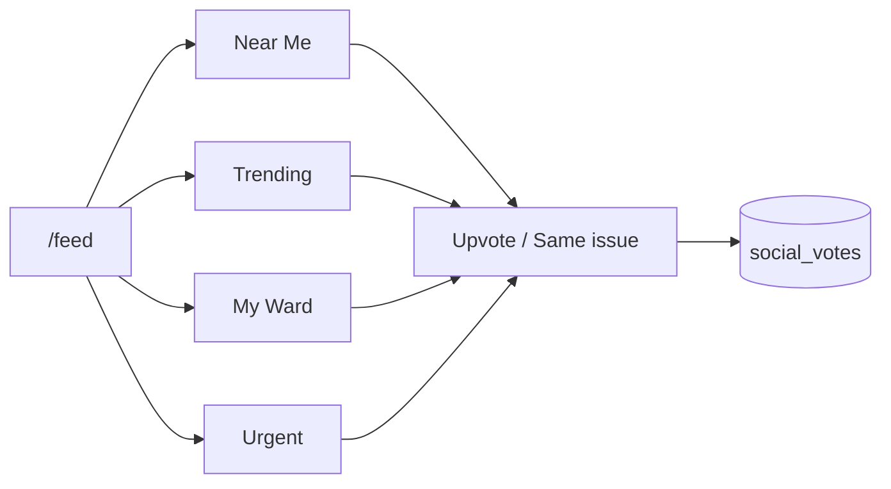
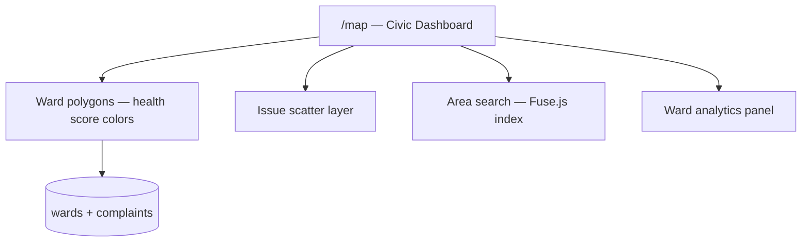
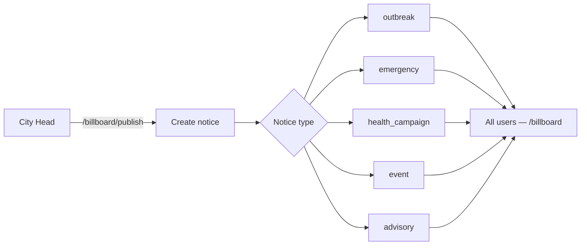
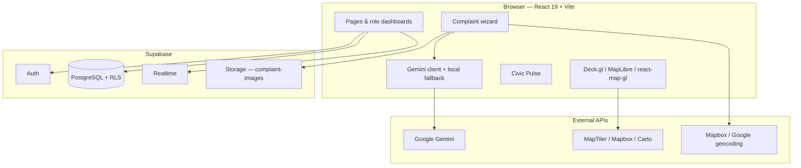

# Nagar Rakshak

### Hyderabad Civic Command

> **Your city. Your voice.**  
> *Complaints on the map. Fixes on the record.*

[](https://react.dev/)
[](https://vitejs.dev/)
[](https://supabase.com/)
[](https://tailwindcss.com/)

---

## The story

Every monsoon, the same lane in **Tolichowki** floods. Residents call, post on social media, and wait. The complaint exists somewhere — in a register, a WhatsApp group, a forgotten desk — but **nobody can see the full timeline**: who filed it, when it was assigned, whether anyone actually visited the site.

In **Miyapur**, potholes near the metro get reported again and again. Neighbours stop believing the system because **status never changes in public view**. In **Secunderabad**, streetlights stay dark for weeks. There is no ticket number, no officer name, no closure proof.

**Nagar Rakshak** (*Guardian of the City*) was built for this gap.

We are not another complaint form that disappears into a black box. We are a **Hyderabad-first civic command platform** — where every report is **geo-tagged, photographed, classified, routed to the right GHMC department, tracked on a ward health map, and held accountable with SLAs, escalations, and citizen verification** before a case is truly closed.

Citizens get a voice. Field workers get clear tasks. Officers get SLA timers. Supervisors and city leadership get **zone-level truth** — not anecdotes.

---

## What we fix

Nagar Rakshak covers the everyday infrastructure and safety issues that shape life in Hyderabad — routed to the departments citizens actually deal with:

| Category | Examples | Routed to |
|----------|----------|-----------|
| **Roads & mobility** | Potholes, broken footpaths, damaged dividers | Roads & Infrastructure |
| **Sanitation** | Garbage dumps, overflowing bins, litter | Solid Waste Management |
| **Water & drainage** | Sewer overflow, flooding, manhole issues | Drainage & Sewerage / HMWSSB |
| **Utilities** | Power cuts, streetlight outages | TSSPDCL / Street Lighting |
| **Public spaces** | Park damage, horticulture, playgrounds | Parks & Horticulture |
| **Safety** | Harassment, unsafe areas, fire hazards | Women Safety / Fire & Safety |
| **Animals & health** | Stray animals, public health risks | Stray Animals / Public Health |
| **Planning & traffic** | Encroachments, traffic signals | Town Planning / Traffic Police |

Our AI classifier (Google Gemini, with an offline keyword fallback) reads **photos + descriptions** and suggests department, severity (1–5), SLA hours, and reasoning — so a citizen does not need to know whether a flooded lane is HMWSSB or Drainage before filing.

**Safety-sensitive reports** (harassment, stalking, unsafe public spaces) can be flagged for **priority review** — because some issues cannot wait behind a generic queue.

---

## What Nagar Rakshak does

| Capability | What it means for Hyderabad |
|------------|----------------------------|
| **Geo-tagged complaints** | Every issue is pinned on the map with photo evidence and address |
| **AI triage** | Auto-classify dept, severity, and SLA; explain the decision in plain language |
| **Duplicate merging** | Nearby reports for the same problem strengthen one master ticket (~150 m radius) |
| **SLA accountability** | Officers set deadlines after assignment; warnings and breaches surface in dashboards |
| **6-tier role hierarchy** | Citizen → Field Worker → Officer → Supervisor → Zonal → City Head |
| **Escalation ladder** | Stuck cases rise through the chain with audit trail |
| **Ward health map** | Deck.gl + MapLibre visualization of open issues, health scores, and analytics |
| **Civic Pulse feed** | Social layer: Near Me, Trending, My Ward, Urgent — with community votes |
| **City Bulletin** | Official notices: outbreaks, emergencies, health campaigns, advisories |
| **Civic credits & leaderboard** | Gamified participation — verify closures, earn rank as a *Guardian of Hyderabad* |
| **Citizen closure verify** | Accept or **reopen** resolved work — fixes must be real, not checkbox closures |
| **Realtime updates** | Live complaint, notification, and message streams via Supabase |
| **City analytics & PDF export** | City Head dashboards with exportable monthly reports |

Aligned with **UN Sustainable Development Goals** on the platform narrative:

- **SDG 6** — Clean water & sanitation (drainage, leaks, flooding)
- **SDG 11** — Sustainable cities (roads, lighting, public spaces, ward tracking)
- **SDG 16** — Peace, justice & strong institutions (public timelines, accountable response)

---

## Who uses it

Six roles mirror how GHMC-style civic operations actually work:



| Role | Label | What they do |
|------|-------|--------------|
| `citizen` | Citizen | File complaints, track status, vote on feed, verify closures, climb leaderboard |
| `worker` | Field Worker | Accept assigned tasks, mark in progress, upload closure photos, resolve on-site |
| `officer` | Department Officer | Triage dept queue, assign workers, set SLA hours, escalate to supervisor |
| `supervisor` | Zone Supervisor | Oversee zone wards, review officer escalations |
| `zonal` | Zonal Commissioner | Zone analytics, department performance, chronic issue patterns |
| `city` | City Head | City-wide KPIs, publish bulletins, analytics, PDF exports, high-severity alerts |

New signups always start as **citizen**. Staff accounts are provisioned via seed scripts or admin API.

---

## How it works — key flows

### 1. Citizen reports an issue



**After filing:** the citizen sees their complaint on the dashboard, on the **ward map**, and optionally in **Civic Pulse** where neighbours can upvote or mark *same issue*.

---

### 2. Officer → Worker → Resolution



**Complaint statuses:** `open` → `assigned` → `in_progress` → `resolved` → `closed` (or `reopened` if rejected).

---

### 3. Escalation when work stalls



Escalations are stored with `from_role`, `to_role`, reason, and timestamp — visible on supervisor dashboards.

---

### 4. Civic Pulse — community layer



Active, non-duplicate complaints surface here so neighbourhoods see **what others are fighting for**, not isolated tickets.

---

### 5. Ward command map



The production map uses **Deck.gl + MapLibre** with MapTiler basemap (`VITE_MAPTILER_KEY`). A separate **HologramMap** component (3D extruded wards + issue columns) lives in the codebase for immersive visualization demos.

---

### 6. City Bulletin



Bulletins appear in the app shell and zone-filtered contexts so citizens see **official city communication** beside grassroots reports.

---

## System architecture



### Data model (core tables)

| Table | Purpose |
|-------|---------|
| `wards` | GHMC wards — geo, zone, health_score, issue counts |
| `users` | Profiles — role, ward, dept, zone, credits, trust_score |
| `complaints` | Tickets — geo, dept, severity, SLA, assignment, AI reasoning, duplicates |
| `escalations` | Officer → higher-role escalation records |
| `social_votes` | `upvote` / `same_issue` on feed posts |
| `notifications` | In-app alerts (SLA, assignment, resolution, bulletin) |
| `messages` | Per-complaint conversation thread |
| `city_notices` | Bulletin entries |
| `dept_performance` | Monthly department KPI snapshots |

Full schema: [`supabase/schema.sql`](supabase/schema.sql)

---

## App routes

| Route | Access | Screen |
|-------|--------|--------|
| `/` | Public | Landing — story, SDG narrative, sign-in CTA |
| `/login`, `/signup` | Public | Authentication |
| `/dashboard` | Authenticated | Role-based home dashboard |
| `/report` | Citizen only | Multi-step complaint wizard |
| `/feed` | Authenticated | Civic Pulse social feed |
| `/map` | Authenticated | Ward command map & analytics |
| `/billboard` | Authenticated | City notices (read) |
| `/billboard/publish` | City Head | Publish / edit bulletins |
| `/leadership` | Authenticated | Civic credits leaderboard |
| `/city/analytics` | City Head | City-wide analytics |

---

## Tech stack

| Layer | Technology |
|-------|------------|
| **UI** | React 19, Vite 8, React Router 7, Tailwind CSS 3, Framer Motion |
| **State** | React Context, Zustand (`civicStore`) |
| **Backend** | Supabase — Auth, Postgres, Row Level Security, Realtime, Storage |
| **Maps** | Deck.gl 9, MapLibre GL, Mapbox GL, react-map-gl, Turf.js |
| **AI** | Google Gemini (`VITE_GEMINI_KEY`) + offline keyword rules |
| **Charts** | Recharts |
| **PDF reports** | jsPDF + jspdf-autotable |
| **Search** | Fuse.js (ward / area search) |
| **Icons** | lucide-react |

---

## Getting started

### Prerequisites

- **Node.js** 18+
- A **Supabase** project (free tier works for development)
- Optional API keys for full map + AI features (see [Environment variables](#environment-variables))

### 1. Clone & install

```bash
git clone https://github.com/AnirudhPratapSinghYadav/NagarRakshak.git
cd NagarRakshak
npm install
```

### 2. Configure environment

```bash
cp .env.example .env
```

Fill in at minimum:

```env
VITE_SUPABASE_URL=https://your-project.supabase.co
VITE_SUPABASE_ANON_KEY=your-anon-key
```

### 3. Set up the database

In the Supabase SQL editor, run migrations **in order**:

1. [`supabase/schema.sql`](supabase/schema.sql) — core tables, enums, RLS, storage, realtime
2. [`supabase/seed.sql`](supabase/seed.sql) — sample wards, complaints, performance data
3. Optional enhancements:
   - [`supabase/wards_expansion.sql`](supabase/wards_expansion.sql) — wards 9–20
   - [`supabase/city_notices.sql`](supabase/city_notices.sql) + [`city_notices_seed.sql`](supabase/city_notices_seed.sql)
   - [`supabase/safety_sensitive_complaints.sql`](supabase/safety_sensitive_complaints.sql)
   - [`supabase/signup_profile_trigger.sql`](supabase/signup_profile_trigger.sql)
   - [`supabase/escalations_update_policy.sql`](supabase/escalations_update_policy.sql)

### 4. Seed demo users

Add your **service role key** to `.env` (server-side only — never commit):

```env
VITE_SUPABASE_SERVICE_KEY=your-service-role-key
```

Then:

```bash
npm run seed:users
```

### 5. Run locally

```bash
npm run dev
```

Open **http://localhost:5173** (Vite default).

### Build for production

```bash
npm run build
npm run preview
```

---

## Demo accounts

All demo accounts use password: **`demo123`**

| Email | Role | Notes |
|-------|------|-------|
| `citizen1@demo.com` | Citizen | Harshit Divekar — 360 credits |
| `citizen2@demo.com` | Citizen | Priya Sharma |
| `citizen3@demo.com` | Citizen | Anirudh Pratap Singh — 340 credits |
| `citizen4@demo.com` | Citizen | Parth Yadav |
| `citizen5@demo.com` | Citizen | Kavya Reddy |
| `citizen6@demo.com` | Citizen | Rohan Verma |
| `worker1@demo.com` | Field Worker | Roads dept |
| `worker2@demo.com` | Field Worker | Sanitation dept |
| `officer1@demo.com` | Officer | Roads — central routing |
| `officer2@demo.com` | Officer | HMWSSB |
| `supervisor1@demo.com` | Supervisor | South zone |
| `zonal1@demo.com` | Zonal Commissioner | South zone |
| `city1@demo.com` | City Head | GHMC Admin |
| `admin@nagarsevak.in` | City Head | System Admin |

**Try this walkthrough:**

1. Log in as `citizen1@demo.com` → file a complaint at `/report`
2. Log in as `officer1@demo.com` → assign `worker1@demo.com` + SLA
3. Log in as `worker1@demo.com` → resolve with closure photo
4. Back to citizen → verify or reopen closure
5. Open `/map` and `/feed` to see city-wide context

---

## Environment variables

| Variable | Required | Purpose |
|----------|----------|---------|
| `VITE_SUPABASE_URL` | **Yes** | Supabase project URL |
| `VITE_SUPABASE_ANON_KEY` | **Yes** | Client-side auth & data access |
| `VITE_SUPABASE_SERVICE_KEY` | Seed only | Admin user creation (`npm run seed:users`) — **never expose in frontend builds** |
| `VITE_GEMINI_KEY` | Optional | AI photo + text classification |
| `VITE_MAPTILER_KEY` | Optional | Civic map basemap (`/map`) |
| `VITE_MAPBOX_TOKEN` | Optional | Geocoding, hologram style, map previews |
| `VITE_GOOGLE_MAPS_API_KEY` | Optional | Google Maps geolocation helpers |

Without Gemini, the app falls back to **local keyword classification** — fully functional for demos.

Without map keys, map pages show setup guidance; core complaint workflows still work.

---

## Project structure

```
NagarRakshak/
├── public/                    # Static assets (landing case images, logo)
├── scripts/
│   └── seed-demo-users.mjs    # Demo auth + profile seeding
├── supabase/                  # SQL schema, seeds, migrations
├── src/
│   ├── App.jsx                # Routes & auth guards
│   ├── main.jsx               # Providers (Auth, Notifications, Drafts)
│   ├── pages/                 # Route-level screens
│   ├── components/
│   │   ├── auth/              # Login, Signup, CityHeadRoute
│   │   ├── citizen/           # Dashboard, complaint form, leaderboard, closure
│   │   ├── worker/            # Field task dashboard
│   │   ├── officer/           # Department control center
│   │   ├── supervisor/        # Zone oversight + escalations
│   │   ├── zonal/             # Zonal analytics
│   │   ├── city/              # City command + analytics
│   │   ├── feed/              # Civic Pulse (NagarFeed)
│   │   ├── map/               # CivicDashboard, HologramMap, ward layers
│   │   ├── billboard/         # City notices UI
│   │   ├── landing/           # Marketing story + map panel
│   │   ├── layout/            # AppShell, Sidebar, notifications
│   │   ├── shared/            # Badges, SLA timer, modals, map previews
│   │   └── reports/           # PDF export
│   ├── contexts/              # Auth, notifications, drafts, explorer
│   ├── hooks/                 # complaints, realtime, stats, notices
│   ├── lib/                   # supabase, gemini, SLA, routing, maps
│   └── data/                  # Hyderabad wards & anchor points
├── .env.example
├── package.json
└── README.md
```

---

## Scripts

| Command | Description |
|---------|-------------|
| `npm run dev` | Start Vite dev server |
| `npm run build` | Production build |
| `npm run preview` | Preview production build |
| `npm run lint` | ESLint |
| `npm run seed:users` | Create demo accounts via Supabase Admin API |

---

## Why Nagar Rakshak is different

1. **Hyderabad-native** — wards, zones, and departments match how citizens experience GHMC, not a generic ticket system.
2. **Evidence-first** — photos, GPS, and timestamps; not “trust me” text forms.
3. **AI that explains itself** — every classification includes human-readable reasoning.
4. **Accountability by design** — SLAs, escalations, reopen flow, and public feed visibility.
5. **Map as command center** — ward health is spatial, not buried in spreadsheets.
6. **Citizen power after resolution** — you confirm the fix; the city does not self-close your issue.
7. **Works offline-ish** — local classifier + graceful degradation when API keys are missing.

---

## Contributing

Contributions welcome. Please open an issue before large changes. For database changes, add SQL files under `supabase/` and document the run order in your PR.

---

## License

This project is maintained as a civic-tech demonstration platform. Add your license file here if you open-source under a specific terms (MIT, Apache-2.0, etc.).

---

<p align="center">
  <strong>Nagar Rakshak</strong> — because Hyderabad deserves complaints on the map and fixes on the record.
</p>
