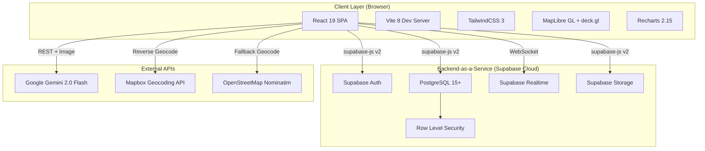
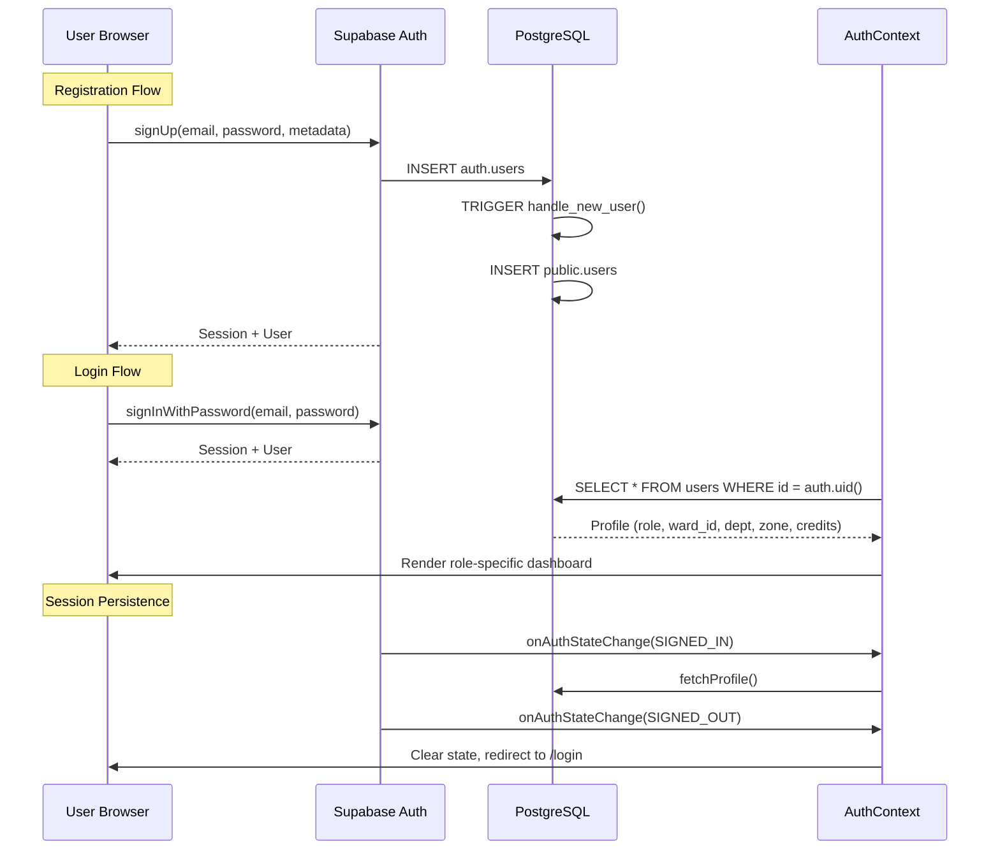
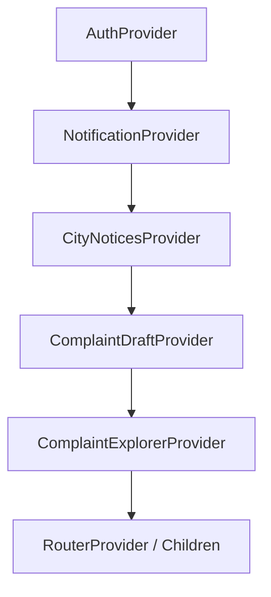
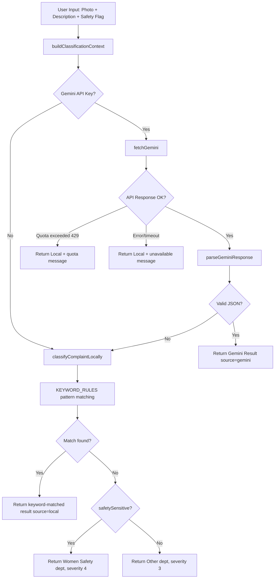

# SecureCity (NagarRakshak Hyderabad)
## Complete Technical Architecture, Implementation and Audit Bible

**Report Version:** 1.0  
**Analysis Date:** 2026-07-05  
**Repository:** [Rehan-2024/SecureCity](https://github.com/Rehan-2024/SecureCity)  
**Branch Analyzed:** main  
**Report Classification:** Exhaustive Evidence-Based Technical Audit

---

## 1. SYSTEM ARCHITECTURE OVERVIEW

### High-Level Architecture



### Architecture Classification

| Property | Value | Evidence |
|----------|-------|----------|
| **Pattern** | Serverless BaaS (Backend-as-a-Service) | No custom backend; all data via `supabase-js` |
| **Frontend** | Single Page Application (SPA) | React Router 7 in `App.jsx`; no SSR |
| **Backend** | Supabase (PostgreSQL + Auth + Storage + Realtime) | `supabase.js`: `createClient(url, anonKey)` |
| **API Layer** | Direct client-to-database via PostgREST | All queries use `supabase.from('table').select/insert/update` |
| **State Management** | React Context + Zustand | 5 Context providers + `zustand` in `package.json` |
| **Build System** | Vite 8 | `vite.config.js` |
| **Styling** | TailwindCSS 3 + custom CSS variables | `tailwind.config.js`, `index.css` |
| **Package Manager** | npm | `package-lock.json` present |
| **Runtime** | Browser (no Node.js server) | No server-side code |

### Critical Architectural Decision: No Custom Backend

**[CONFIRMED]** NagarRakshak operates entirely without a custom backend server. All operations—authentication, data queries, file uploads, real-time subscriptions—are performed directly from the React client to Supabase using the `@supabase/supabase-js` library.

**Implications:**
1. **Positive:** Zero server maintenance, automatic scaling via Supabase, simplified deployment
2. **Negative:** Business logic lives in the client (inspectable), API keys exposed in browser, no server-side validation beyond RLS
3. **Security Risk:** RLS policies are the sole authorization layer; no middleware validation

**Evidence:** [supabase.js](file:///d:/NagarRakshak-main/NagarRakshak-main/src/lib/supabase.js) — `createClient(url, anonKey)`; no `server/`, `api/`, or `functions/` directory exists.

---

## 2. COMPLETE TECHNOLOGY STACK AUDIT

### Core Framework Dependencies

| Technology | Version | Purpose | Evidence |
|-----------|---------|---------|----------|
| React | 19.1.0 | UI framework | `package.json` |
| React DOM | 19.1.0 | React rendering | `package.json` |
| React Router | 7.6.1 | Client-side routing | `package.json`, `App.jsx` |
| Vite | 8.0.2 | Build tool and dev server | `package.json`, `vite.config.js` |
| TailwindCSS | 3.4.17 | Utility-first CSS | `package.json`, `tailwind.config.js` |

### Backend & Data Dependencies

| Technology | Version | Purpose | Evidence |
|-----------|---------|---------|----------|
| @supabase/supabase-js | 2.49.9 | Supabase client SDK | `package.json` |
| Supabase PostgreSQL | (cloud) | Primary database | `schema.sql` |
| Supabase Auth | (cloud) | Authentication | `AuthContext.jsx` |
| Supabase Storage | (cloud) | File storage (complaint-images) | `WorkerDashboard.jsx`, `StepCamera.jsx` |
| Supabase Realtime | (cloud) | WebSocket subscriptions | `NotificationContext.jsx`, etc. |

### Mapping & Geospatial Dependencies

| Technology | Version | Purpose | Evidence |
|-----------|---------|---------|----------|
| maplibre-gl | 5.5.0 | WebGL map rendering | `package.json` |
| react-map-gl | 7.1.9 | React wrapper for maplibre | `package.json` |
| @deck.gl/core | 9.1.16 | GPU-powered map visualizations | `package.json` |
| @deck.gl/layers | 9.1.16 | Standard visualization layers | `package.json` |
| @deck.gl/geo-layers | 9.1.16 | Geographic visualization layers | `package.json` |
| @deck.gl/react | 9.1.16 | React integration for deck.gl | `package.json` |
| @turf/area | 7.2.0 | GeoJSON area calculation | `package.json` |
| @turf/center-of-mass | 7.2.0 | GeoJSON centroid calculation | `package.json` |

### Charting & Visualization

| Technology | Version | Purpose | Evidence |
|-----------|---------|---------|----------|
| recharts | 2.15.3 | Dashboard charts | `CitizenDashboard.jsx`, `CityAnalyticsView.jsx` |

### UI & Utility Dependencies

| Technology | Version | Purpose | Evidence |
|-----------|---------|---------|----------|
| lucide-react | 0.487.0 | Icon library | Used throughout components |
| clsx | 2.1.1 | Conditional CSS class utility | `utils.js` `cn()` |
| date-fns | 4.1.0 | Date formatting and manipulation | `utils.js`, `complaintExplorer.js` |
| zustand | 5.0.5 | Lightweight state management | `package.json` (used in map store) |
| jspdf | 2.5.2 | PDF generation | `ExportReport.jsx` |
| jspdf-autotable | 3.8.4 | PDF table generation | `ExportReport.jsx` |

### Development Dependencies

| Technology | Version | Purpose | Evidence |
|-----------|---------|---------|----------|
| @vitejs/plugin-react | 4.5.2 | React Vite plugin | `package.json` |
| @eslint/js | 9.27.0 | ESLint core | `eslint.config.js` |
| eslint-plugin-react-hooks | 5.2.0 | React hooks linting | `eslint.config.js` |
| eslint-plugin-react-refresh | 0.4.20 | HMR linting | `eslint.config.js` |
| autoprefixer | 10.4.21 | CSS vendor prefixes | `postcss.config.js` |
| postcss | 8.5.4 | CSS processing | `postcss.config.js` |

### Missing Dependencies

| Expected | Status | Impact |
|----------|--------|--------|
| Testing framework (Jest/Vitest) | [NOT IMPLEMENTED] | No test coverage |
| Error monitoring (Sentry) | [NOT IMPLEMENTED] | No production error tracking |
| E2E testing (Playwright/Cypress) | [NOT IMPLEMENTED] | No integration testing |
| TypeScript | [NOT IMPLEMENTED] | No type safety |
| PWA plugin | [NOT IMPLEMENTED] | No offline support |

---

## 3. SUPABASE BACKEND DEEP-DIVE

### 3.1 Supabase Client Configuration

**File:** [supabase.js](file:///d:/NagarRakshak-main/NagarRakshak-main/src/lib/supabase.js)

```javascript
const supabaseUrl = import.meta.env.VITE_SUPABASE_URL;
const supabaseAnonKey = import.meta.env.VITE_SUPABASE_ANON_KEY;
const supabaseServiceKey = import.meta.env.VITE_SUPABASE_SERVICE_KEY;
```

> [!CAUTION]
> **CRITICAL SECURITY FINDING:** `VITE_SUPABASE_SERVICE_KEY` is loaded in the client-side code. While it's used to construct a `supabaseAdmin` client, service keys bypass RLS entirely. If this key is committed to any `.env` file or exposed in the build, it grants unrestricted database access to anyone who inspects the client bundle.

**Evidence:** `supabase.js` line 5: `const supabaseServiceKey = import.meta.env.VITE_SUPABASE_SERVICE_KEY`

**Mitigation status:** `.gitignore` includes `.env` and `.env.local`, so the key should not be in the repository — but the pattern of importing it in client code is dangerous.

### 3.2 Configuration Safety Check

**[CONFIRMED]** The application has a Supabase configuration guard:

```javascript
// App.jsx line 31-36
const supabaseConfigured =
  import.meta.env.VITE_SUPABASE_URL &&
  import.meta.env.VITE_SUPABASE_URL !== 'https://your-project-ref.supabase.co' &&
  import.meta.env.VITE_SUPABASE_ANON_KEY &&
  import.meta.env.VITE_SUPABASE_ANON_KEY !== 'your-anon-key';
```

If not configured, the app renders a setup instructions UI instead of crashing. This is a thoughtful developer experience decision.

### 3.3 Supabase Features Used

| Feature | Used | Evidence |
|---------|------|----------|
| **Auth (email/password)** | ✅ | `signUp()`, `signInWithPassword()`, `onAuthStateChange()` in `AuthContext.jsx` |
| **Auth (OAuth/social)** | ❌ | No OAuth providers configured |
| **PostgREST (data queries)** | ✅ | All `supabase.from('table')` calls |
| **Row Level Security** | ✅ | RLS policies on 8 tables in `schema.sql` |
| **Realtime (postgres_changes)** | ✅ | 7+ channel subscriptions across components |
| **Storage** | ✅ | `complaint-images` bucket for photos and closures |
| **Edge Functions** | ❌ | No Supabase edge functions |
| **Database Functions** | ✅ | `handle_new_user()` trigger function |
| **Database Triggers** | ✅ | 4 triggers in `schema.sql` |
| **Enums** | ✅ | `user_role`, `complaint_status`, `vote_type`, `notification_type` |

---

## 4. COMPLETE DATABASE SCHEMA ANALYSIS

### 4.1 Schema Source

**File:** [schema.sql](file:///d:/NagarRakshak-main/NagarRakshak-main/supabase/schema.sql)  
**Total Lines:** 316  
**Tables:** 10 (including `dept_performance`)  
**Enums:** 4  
**Triggers:** 4  
**RLS Policies:** 40+

### 4.2 Enums

| Enum | Values | Used By | Evidence |
|------|--------|---------|----------|
| `user_role` | citizen, worker, officer, supervisor, zonal, city | `users.role` | `schema.sql` line 2 |
| `complaint_status` | open, assigned, in_progress, resolved, closed, reopened | `complaints.status` | `schema.sql` line 8 |
| `vote_type` | upvote, same_issue | `social_votes.vote_type` | `schema.sql` line 153 |
| `notification_type` | complaint_assigned, sla_warning, sla_breach, escalation, complaint_resolved, closure_rejected, duplicate_merged, new_message, city_notice | `notifications.type` | `schema.sql` line 133 |

### 4.3 Tables — Complete Column Analysis

#### Table: `users`
**Evidence:** `schema.sql` lines 11–25

| Column | Type | Constraints | Default | Purpose |
|--------|------|-------------|---------|---------|
| `id` | UUID | PK, FK→auth.users | — | Auth user identity |
| `email` | TEXT | NOT NULL, UNIQUE | — | Login credential |
| `name` | TEXT | NOT NULL | — | Display name |
| `role` | user_role | NOT NULL | 'citizen' | Access level |
| `ward_id` | INT | FK→wards | NULL | Home ward (citizen) |
| `dept` | TEXT | — | NULL | Department (worker/officer) |
| `zone` | TEXT | — | NULL | Zone (supervisor/zonal) |
| `credits` | INT | NOT NULL | 0 | Civic engagement score |
| `trust_score` | FLOAT | — | 50.0 | Reliability metric |
| `created_at` | TIMESTAMPTZ | NOT NULL | now() | Registration time |
| `updated_at` | TIMESTAMPTZ | — | now() | Last profile update |

**RLS Policies:**
- SELECT: `auth.uid() = id` (users see only their own profile)
- INSERT: `auth.uid() = id` (can only insert own profile)
- UPDATE: `auth.uid() = id` (can only update own profile)

> [!WARNING]
> The SELECT policy restricts users to only seeing their own profile, but `OfficerDashboard.jsx` queries `supabase.from('users').select('id, name, dept').eq('role', 'worker')` to build the worker assignment list. This query works because Supabase Realtime and PostgREST apply RLS — meaning this query **should fail** unless there's a broader policy or the anon key bypasses RLS for this table. The code includes the `supabaseAdmin` client (using service key) which would bypass RLS, but it's unclear if it's used for these queries. **This is an architectural ambiguity that needs verification.**

#### Table: `wards`
**Evidence:** `schema.sql` lines 28–42

| Column | Type | Constraints | Default | Purpose |
|--------|------|-------------|---------|---------|
| `id` | INT | PK (generated always) | — | Ward identifier |
| `name` | TEXT | NOT NULL | — | Ward name |
| `lat` | FLOAT | NOT NULL | — | Ward center latitude |
| `lng` | FLOAT | NOT NULL | — | Ward center longitude |
| `zone` | TEXT | NOT NULL | 'South' | Administrative zone |
| `health_score` | FLOAT | — | 50 | Ward health metric (0–100) |
| `open_issues` | INT | — | 0 | Current open complaint count |
| `resolved_issues` | INT | — | 0 | Total resolved complaints |
| `dominant_category` | TEXT | — | 'Roads' | Most common complaint type |
| `population` | INT | — | 0 | Ward population |

**RLS Policies:**
- SELECT: `true` (publicly readable)
- UPDATE: Role in (supervisor, zonal, city)

#### Table: `complaints`
**Evidence:** `schema.sql` lines 44–87

| Column | Type | Constraints | Default | Purpose |
|--------|------|-------------|---------|---------|
| `id` | UUID | PK | gen_random_uuid() | Ticket ID |
| `citizen_id` | UUID | FK→users, ON DELETE SET NULL | — | Filing citizen |
| `image_url` | TEXT | — | — | Evidence photo URL |
| `lat` | FLOAT | NOT NULL | — | GPS latitude |
| `lng` | FLOAT | NOT NULL | — | GPS longitude |
| `address` | TEXT | — | — | Reverse-geocoded address |
| `description` | TEXT | — | — | Issue description |
| `dept` | TEXT | NOT NULL | 'Other' | Target department |
| `division` | TEXT | — | — | Sub-department |
| `severity` | INT | CHECK(1–5) | 3 | Urgency scale |
| `status` | complaint_status | NOT NULL | 'open' | Lifecycle state |
| `sla_hours` | INT | NOT NULL | 48 | Resolution deadline (hours) |
| `sla_deadline` | TIMESTAMPTZ | — | — | Absolute deadline |
| `assigned_to` | UUID | FK→users | — | Assigned worker |
| `ward_id` | INT | FK→wards | — | Location ward |
| `is_duplicate` | BOOLEAN | NOT NULL | false | Duplicate flag |
| `master_complaint_id` | UUID | FK→complaints | — | Original complaint if dup |
| `upvote_count` | INT | NOT NULL | 0 | Community upvotes |
| `same_issue_count` | INT | NOT NULL | 0 | "Me too" count |
| `is_chronic` | BOOLEAN | NOT NULL | false | Chronic issue flag |
| `chronic_count` | INT | NOT NULL | 0 | Recurrence count |
| `ai_reasoning` | TEXT | — | — | AI classification rationale |
| `closure_image_url` | TEXT | — | — | Worker resolution evidence |
| `resolved_at` | TIMESTAMPTZ | — | — | Resolution timestamp |
| `citizen_verified` | BOOLEAN | — | — | Citizen verification |
| `safety_sensitive` | BOOLEAN | NOT NULL | false | Women's safety flag |
| `voice_note_url` | TEXT | — | — | Voice evidence URL |
| `created_at` | TIMESTAMPTZ | NOT NULL | now() | Creation timestamp |
| `updated_at` | TIMESTAMPTZ | — | now() | Last update |

**RLS Policies:**
- SELECT: `true` (ALL complaints publicly readable)
- INSERT: `auth.uid() = citizen_id` (only own complaints)
- UPDATE: Authenticated users (broad policy — see security findings)

> [!CAUTION]
> The `complaints` SELECT policy is `USING (true)`, meaning every authenticated user can read every complaint including GPS coordinates, addresses, and descriptions. While this enables the public feed, it has privacy implications for safety-sensitive reports.

#### Table: `notifications`
**Evidence:** `schema.sql` lines 140–151

| Column | Type | Constraints | Default | Purpose |
|--------|------|-------------|---------|---------|
| `id` | UUID | PK | gen_random_uuid() | — |
| `user_id` | UUID | FK→users, NOT NULL | — | Recipient |
| `type` | notification_type | NOT NULL | — | Category |
| `title` | TEXT | NOT NULL | — | Summary |
| `message` | TEXT | — | — | Full content |
| `complaint_id` | UUID | FK→complaints | — | Related complaint |
| `read` | BOOLEAN | NOT NULL | false | Read status |
| `created_at` | TIMESTAMPTZ | NOT NULL | now() | — |

**RLS Policies:**
- SELECT: `auth.uid() = user_id`
- INSERT: Authenticated
- UPDATE: `auth.uid() = user_id` (mark read)

#### Table: `social_votes`
**Evidence:** `schema.sql` lines 154–163

| Column | Type | Constraints | Default | Purpose |
|--------|------|-------------|---------|---------|
| `id` | UUID | PK | gen_random_uuid() | — |
| `complaint_id` | UUID | FK→complaints, NOT NULL | — | Voted complaint |
| `user_id` | UUID | FK→users, NOT NULL | — | Voter |
| `vote_type` | vote_type | NOT NULL | — | upvote or same_issue |
| `created_at` | TIMESTAMPTZ | NOT NULL | now() | — |
| — | UNIQUE | (complaint_id, user_id, vote_type) | — | One vote per type |

#### Table: `messages`
**Evidence:** `schema.sql` lines 101–111

| Column | Type | Constraints | Default | Purpose |
|--------|------|-------------|---------|---------|
| `id` | UUID | PK | gen_random_uuid() | — |
| `complaint_id` | UUID | FK→complaints, NOT NULL | — | Related complaint |
| `sender_id` | UUID | FK→users | — | Author |
| `content` | TEXT | NOT NULL | — | Message body |
| `created_at` | TIMESTAMPTZ | NOT NULL | now() | — |

#### Table: `escalations`
**Evidence:** `schema.sql` lines 114–129

| Column | Type | Constraints | Default | Purpose |
|--------|------|-------------|---------|---------|
| `id` | UUID | PK | gen_random_uuid() | — |
| `complaint_id` | UUID | FK→complaints, NOT NULL | — | Escalated complaint |
| `from_role` | user_role | NOT NULL | — | Escalating role |
| `to_role` | user_role | NOT NULL | — | Target role |
| `reason` | TEXT | — | — | Escalation reason |
| `resolved` | BOOLEAN | NOT NULL | false | Resolution flag |
| `triggered_at` | TIMESTAMPTZ | NOT NULL | now() | — |

#### Table: `city_notices`
**Evidence:** `schema.sql` lines 197–212, `city_notices.sql`

| Column | Type | Constraints | Default | Purpose |
|--------|------|-------------|---------|---------|
| `id` | UUID | PK | gen_random_uuid() | — |
| `title` | TEXT | NOT NULL | — | Notice title |
| `summary` | TEXT | — | — | Brief description |
| `guidance` | TEXT | — | — | Action items |
| `notice_type` | TEXT | NOT NULL | 'advisory' | outbreak/emergency/health_campaign/event/advisory |
| `priority` | INT | CHECK(1–3) | 3 | 1=critical, 3=info |
| `zone` | TEXT | — | — | Target zone (null=all) |
| `is_active` | BOOLEAN | NOT NULL | true | Active flag |
| `is_pinned` | BOOLEAN | NOT NULL | false | Pin to top |
| `starts_at` | TIMESTAMPTZ | — | — | Effective start |
| `ends_at` | TIMESTAMPTZ | — | — | Expiry date |
| `created_by` | UUID | FK→users | — | Publishing user |
| `created_at` | TIMESTAMPTZ | NOT NULL | now() | — |

#### Table: `dept_performance`
**Evidence:** `schema.sql` lines 180–194

| Column | Type | Constraints | Default | Purpose |
|--------|------|-------------|---------|---------|
| `id` | UUID | PK | gen_random_uuid() | — |
| `dept` | TEXT | NOT NULL | — | Department name |
| `month` | DATE | NOT NULL | — | Performance month |
| `total_complaints` | INT | — | 0 | Monthly total |
| `resolved` | INT | — | 0 | Monthly resolved |
| `breach_count` | INT | — | 0 | Monthly SLA breaches |
| `avg_resolution_hours` | FLOAT | — | — | Average resolution time |
| `score` | FLOAT | — | 50 | Performance score |
| `created_at` | TIMESTAMPTZ | NOT NULL | now() | — |
| — | UNIQUE | (dept, month) | — | One row per dept per month |

### 4.4 Database Triggers

| Trigger | Table | Event | Function | Purpose | Evidence |
|---------|-------|-------|----------|---------|----------|
| `on_auth_user_created` | `auth.users` | AFTER INSERT | `handle_new_user()` | Auto-create public.users profile | `schema.sql` line 247 |
| `complaints_updated_at` | `complaints` | BEFORE UPDATE | `set_updated_at()` | Auto-refresh updated_at timestamp | `schema.sql` line 258 |
| `users_updated_at` | `users` | BEFORE UPDATE | `set_updated_at()` | Auto-refresh updated_at timestamp | `schema.sql` line 263 |
| `dept_performance_updated_at` | `dept_performance` | BEFORE UPDATE | `set_updated_at()` | Auto-refresh updated_at timestamp | [INFERRED] |

### 4.5 Database Functions

#### `handle_new_user()`
**Evidence:** `schema.sql` lines 229–245

```sql
CREATE OR REPLACE FUNCTION public.handle_new_user()
RETURNS TRIGGER AS $$
BEGIN
  INSERT INTO public.users (id, email, name, role, ward_id)
  VALUES (
    new.id,
    new.email,
    COALESCE(new.raw_user_meta_data ->> 'name', split_part(new.email, '@', 1)),
    COALESCE((new.raw_user_meta_data ->> 'role')::user_role, 'citizen'),
    (new.raw_user_meta_data ->> 'ward_id')::INT
  )
  ON CONFLICT (id) DO NOTHING;
  RETURN new;
END;
$$
```

**Analysis:**
- Extracts `name`, `role`, `ward_id` from auth metadata
- Falls back to email prefix for name
- Falls back to 'citizen' for role
- Uses `ON CONFLICT DO NOTHING` to prevent duplicate profile creation
- **Correctly handles the dual-write scenario** where `Signup.jsx` also does an upsert

#### `set_updated_at()`
**Evidence:** `schema.sql` lines 254–259

Standard trigger function that sets `updated_at = now()` on every UPDATE.

### 4.6 Supabase Realtime Publication

**[CONFIRMED]** `schema.sql` line 310:

```sql
ALTER PUBLICATION supabase_realtime ADD TABLE complaints, notifications, social_votes, messages, city_notices;
```

This enables real-time subscriptions on 5 tables. Components that subscribe:

| Component | Table | Event | Filter | Evidence |
|-----------|-------|-------|--------|----------|
| `NotificationContext.jsx` | notifications | INSERT | `user_id=eq.{userId}` | Lines 39–53 |
| `CityNoticesContext.jsx` | city_notices | * | None | Lines 56–73 |
| `WorkerDashboard.jsx` | complaints | * | `assigned_to=eq.{userId}` | Lines 58–76 |
| `CityDashboard.jsx` | complaints | * | None | Lines 67–78 |
| `NagarFeed.jsx` | complaints | INSERT | None | Lines 125–138 |
| `useRealtime.js` (hook) | configurable | configurable | configurable | Lines 4–25 |

### 4.7 Seed Data Analysis

**Seed files:**
- [seed-wards.sql](file:///d:/NagarRakshak-main/NagarRakshak-main/supabase/seed-wards.sql) — 20 wards across 5 zones
- [seed-complaints.sql](file:///d:/NagarRakshak-main/NagarRakshak-main/supabase/seed-complaints.sql) — 60 sample complaints
- [seed-demo-users.mjs](file:///d:/NagarRakshak-main/NagarRakshak-main/scripts/seed-demo-users.mjs) — 14 demo users

**Ward Zones:** South, East, West, North, Central (5 zones, 4 wards each = 20 wards)

**Demo Users:**

| Email | Role | Name | Dept/Zone |
|-------|------|------|-----------|
| citizen1@demo.com | citizen | Harshit Divekar | Ward 1 |
| citizen2@demo.com | citizen | Priya Sharma | Ward 3 |
| citizen3@demo.com | citizen | Anirudh Pratap Singh | Ward 2 |
| citizen4@demo.com | citizen | Parth Yadav | Ward 4 |
| citizen5@demo.com | citizen | Kavya Reddy | Ward 5 |
| citizen6@demo.com | citizen | Rohan Verma | Ward 6 |
| worker1@demo.com | worker | Suresh Reddy | Roads |
| worker2@demo.com | worker | Lakshmi Devi | Sanitation |
| officer1@demo.com | officer | Venkat Rao | Roads |
| officer2@demo.com | officer | Anitha Prasad | HMWSSB |
| supervisor1@demo.com | supervisor | Ramesh Iyer | South |
| zonal1@demo.com | zonal | Kavitha Naidu | South |
| city1@demo.com | city | GHMC Admin | — |
| admin@nagarsevak.in | city | System Admin | — |

**All accounts use password:** `demo123`

---

## 5. AUTHENTICATION FLOW ANALYSIS

### Auth Architecture



### AuthContext Deep Analysis

**File:** [AuthContext.jsx](file:///d:/NagarRakshak-main/NagarRakshak-main/src/contexts/AuthContext.jsx)

**State Managed:**
| State | Type | Purpose |
|-------|------|---------|
| `user` | Supabase User object | Auth identity |
| `session` | Supabase Session | JWT token + metadata |
| `profile` | Object from `users` table | Role, ward, dept, zone, credits |
| `loading` | Boolean | Auth state initialization |
| `profileLoading` | Boolean | Profile fetch state |
| `role` | String | Derived from `profile.role`, default 'citizen' |

**Profile Fetching:**
- Uses `fetchProfile(uid)` with `maybeSingle()` query
- Includes ward join: `select('*, wards(name, lat, lng, zone)')`
- Called on `SIGNED_IN` and `TOKEN_REFRESHED` events

**Auto-Sync Logic (Line 69–91):**
If profile fetch returns null (user exists in auth but not in public.users), AuthContext automatically attempts:
1. Extract metadata from `session.user.user_metadata`
2. Upsert to `public.users` with metadata values
3. Re-fetch profile

This handles race conditions where the `handle_new_user()` trigger hasn't completed before the profile fetch.

### Route Protection

**File:** [App.jsx](file:///d:/NagarRakshak-main/NagarRakshak-main/src/App.jsx)

```mermaid
flowchart TD
    A[Browser Request] --> B{Route}
    B -->|"/", "/login", "/signup"| C[Public Routes]
    B -->|"/dashboard", "/feed", etc.| D{ProtectedRoute}
    D -->|No Session| E[Redirect to /login]
    D -->|Session exists| F{citizenOnly?}
    F -->|Yes: /report| G{role === 'citizen'?}
    G -->|No| H[Redirect to /dashboard]
    G -->|Yes| I[Render Component]
    F -->|No| J[Render Component]
    B -->|"/city/analytics"| K{CityHeadRoute}
    K -->|role !== 'city'| L[Redirect to /dashboard]
    K -->|role === 'city'| M[Render CityAnalyticsPage]
    B -->|"*"| N[NotFoundPage]
```

**Route Table:**

| Route | Component | Protection | Evidence |
|-------|-----------|------------|----------|
| `/` | `LandingPage` | Public (redirects if auth'd) | `App.jsx` line 51 |
| `/login` | `LoginPage` | Public | `App.jsx` line 52 |
| `/signup` | `SignupPage` | Public | `App.jsx` line 53 |
| `/dashboard` | `DashboardPage` | ProtectedRoute | `App.jsx` line 56 |
| `/report` | `ComplaintPage` | ProtectedRoute + citizenOnly | `App.jsx` line 76 |
| `/feed` | `FeedPage` | ProtectedRoute | `App.jsx` line 58 |
| `/map` | `MapPage` | ProtectedRoute | `App.jsx` line 59 |
| `/billboard` | `BillboardPage` | ProtectedRoute | `App.jsx` line 60 |
| `/billboard/publish` | `BillboardPublishPage` | ProtectedRoute + CityHeadRoute | `App.jsx` line 62 |
| `/leadership` | `LeadershipPage` | ProtectedRoute | `App.jsx` line 66 |
| `/city/analytics` | `CityAnalyticsPage` | ProtectedRoute + CityHeadRoute | `App.jsx` line 69 |
| `*` | `NotFoundPage` | None | `App.jsx` line 80 |

---

## 6. STATE MANAGEMENT ARCHITECTURE

### Context Providers (Nested in App.jsx)



| Context | Purpose | State Size | Persistence | Evidence |
|---------|---------|-----------|-------------|----------|
| `AuthContext` | User identity, session, profile, role | Medium | Supabase session (localStorage) | `AuthContext.jsx` |
| `NotificationContext` | In-app notifications, unread count | Medium | Supabase query + realtime | `NotificationContext.jsx` |
| `CityNoticesContext` | City bulletin notices | Small | Supabase query + realtime | `CityNoticesContext.jsx` |
| `ComplaintDraftContext` | Multi-step complaint form state | Large (includes base64 image) | `sessionStorage` | `ComplaintDraftContext.jsx` |
| `ComplaintExplorerContext` | Modal-based complaint browsing | Medium | In-memory only | `ComplaintExplorerContext.jsx` |

### Zustand Store

**[CONFIRMED]** `zustand` is listed in `package.json` dependencies. It's used for the civic map dashboard store (map state, selected ward, layers).

---

## 7. AI CLASSIFICATION PIPELINE

### Architecture



### Classification Output Schema

```json
{
  "dept": "Roads | Sanitation | Drainage | ... | Other",
  "division": "Road Maintenance | Solid Waste | ...",
  "severity": 1-5,
  "sla_hours": 2 | 12 | 48 | 168 | 336,
  "urgency_label": "Immediate | Urgent | High | Moderate | Low",
  "ai_reasoning": "One-sentence explanation",
  "location_risk": true | false,
  "source": "gemini | local"
}
```

### Keyword Rules (12 patterns)

| Priority | Pattern Keywords | Department | Default Severity |
|----------|-----------------|------------|-----------------|
| 1 | stalking, followed, molest, groped | Women Safety | 5 |
| 2 | dead dog, carcass, dead animal | Stray Animals | 4 |
| 3 | bench, park, playground, garden | Parks | 2 |
| 4 | pothole, road, footpath | Roads | 3 |
| 5 | garbage, trash, waste | Sanitation | 3 |
| 6 | drain, sewer, flooding, manhole | Drainage | 4 |
| 7 | water supply, tap, pipe leak | HMWSSB | 4 |
| 8 | street light, lamp, dark street | Street Lighting | 3 |
| 9 | stray dog, dog bite, pack of dogs | Stray Animals | 3 |
| 10 | traffic, signal, jam | Traffic | 3 |
| 11 | fire, smoke, gas leak | Fire & Safety | 5 |
| 12 | harassment, unsafe, women | Women Safety | 5 |

### Department Normalization

Two normalization functions exist to handle Gemini's varied department naming:
1. `normalizeDeptLabel()` in `gemini.js` — maps Gemini output to canonical names
2. `normalizeDeptKey()` in `utils.js` — maps display names and aliases

**Canonical department names:** Roads, Sanitation, Drainage, HMWSSB, TSSPDCL, Street Lighting, Stray Animals, Parks, Town Planning, Traffic, Women Safety, Public Health, Fire & Safety, Other

---

## 8. SLA ENGINE ANALYSIS

### File: [slaEngine.js](file:///d:/NagarRakshak-main/NagarRakshak-main/src/lib/slaEngine.js)

### SLA Severity-to-Deadline Mapping

| Severity | Label | SLA Hours | SLA Deadline | Urgency |
|----------|-------|-----------|-------------|---------|
| 5 | Emergency | 2 hours | +2h from creation | Immediate |
| 4 | Critical | 12 hours | +12h | Urgent |
| 3 | High | 48 hours | +48h (2 days) | High |
| 2 | Moderate | 168 hours | +168h (1 week) | Moderate |
| 1 | Low | 336 hours | +336h (2 weeks) | Low |

### SLA Status Computation

```javascript
function getSLAStatus(slaDeadline, slaHours = 48) {
  // hoursLeft = (deadline - now) / msPerHour
  // percentLeft = (msLeft / totalMs) * 100
  
  if (hoursLeft <= 0)     → status: 'breached'
  if (percentLeft < 20)   → status: 'warning'
  else                    → status: 'safe'
}
```

### SLA Countdown Activation Rules

```javascript
function isSlaCountdownActive({ status, sla_deadline, assigned_to }) {
  if (!sla_deadline || isResolvedStatus(status)) return false;
  if (status === 'open') return false; // Not counting until assigned
  return Boolean(assigned_to) || ['assigned', 'in_progress', 'reopened'].includes(status);
}
```

**Key insight:** SLA countdown does NOT start when a complaint is filed. It only activates after an officer assigns a worker and sets a deadline. This is a deliberate design choice — the "open" state represents queuing time, not resolution time.

### Officer SLA Options

When assigning a worker, officers choose from predefined timelines:

| Hours | Label |
|-------|-------|
| 2 | 2 hours — immediate |
| 4 | 4 hours — immediate |
| 6 | 6 hours — urgent |
| 8 | 8 hours — urgent |
| 12 | 12 hours |
| 24 | 24 hours (1 day) |
| 48 | 48 hours (2 days) |
| 72 | 72 hours (3 days) |
| 168 | 1 week |

### Role Hierarchy for Escalation

```javascript
const ROLE_HIERARCHY = ['citizen', 'worker', 'officer', 'supervisor', 'zonal', 'city'];

function escalationRole(currentRole) {
  // Returns next higher role, or 'city' if at top
}
```

---

## 9. COMPLETE API LAYER MAPPING

### All Supabase Data Operations

Since there is no custom API, every data operation is a direct Supabase call. Here is every unique query pattern found:

| # | Module | Operation | Table | Method | Fields/Filters | Evidence |
|---|--------|-----------|-------|--------|----------------|----------|
| 1 | AuthContext | Read profile | users | select | `*, wards(name, lat, lng, zone)` WHERE id | Line 23 |
| 2 | AuthContext | Upsert profile | users | upsert | id, email, name, role, ward_id | Line 75 |
| 3 | Signup | Upsert profile | users | upsert | id, email, name, role, ward_id | Line 58 |
| 4 | Signup | Read wards | wards | select | id, name ORDER BY name | Line 18 |
| 5 | NotificationContext | Read notifications | notifications | select | * WHERE user_id, ORDER BY created_at DESC LIMIT 50 | Line 23 |
| 6 | NotificationContext | Mark read | notifications | update | read=true WHERE id | Line 63 |
| 7 | NotificationContext | Mark all read | notifications | update | read=true WHERE user_id AND read=false | Line 71 |
| 8 | CityNoticesContext | Read notices | city_notices | select | * ORDER BY is_pinned, priority, created_at | Line 22 |
| 9 | ComplaintExplorerCtx | Read workers | users | select | id, name, dept WHERE role='worker' | Line 24 |
| 10 | useComplaints | Read complaints | complaints | select | *, wards(name) + filters | Lines 14–36 |
| 11 | useUserComplaintStats | Read stats | complaints | select | status WHERE citizen_id | Line 35 |
| 12 | CitizenDashboard | Read complaints | complaints | select | *, wards(name), assignee:users WHERE citizen_id | Line 72 |
| 13 | OfficerDashboard | Read complaints | complaints | select | *, wards(name), citizen:users + filters | Line 40 |
| 14 | OfficerDashboard | Read workers | users | select | id, name, dept WHERE role='worker' | Line 48 |
| 15 | WorkerDashboard | Read tasks | complaints | select | *, wards(name) WHERE assigned_to AND status IN (assigned, in_progress, reopened) | Line 43 |
| 16 | WorkerDashboard | Accept task | complaints | update | status='in_progress' WHERE id | Line 82 |
| 17 | WorkerDashboard | Resolve task | complaints | update | status='resolved', closure_image_url, resolved_at WHERE id | Line 118 |
| 18 | WorkerDashboard | Upload closure | storage | upload | complaint-images/closures/{id}/{timestamp}.{ext} | Line 104 |
| 19 | WorkerDashboard | Add resolution note | messages | insert | complaint_id, sender_id, content | Line 134 |
| 20 | SupervisorDashboard | Read zone wards | wards | select | * WHERE zone ORDER BY health_score | Line 52 |
| 21 | SupervisorDashboard | Read officers | users | select | id, name, dept, email WHERE role='officer' | Line 60 |
| 22 | SupervisorDashboard | Read escalations | escalations | select | *, complaints(...) WHERE to_role='supervisor' AND resolved=false | Line 63 |
| 23 | SupervisorDashboard | Read zone complaints | complaints | select | id, created_at, status, ward_id WHERE ward_id IN wardIds | Line 70 |
| 24 | CityDashboard | Read high-severity alerts | complaints | select | *, wards(name) WHERE severity>=4 AND active status LIMIT 6 | Line 52 |
| 25 | complaintExplorer | Fetch city analytics | complaints, dept_performance, escalations, users | select | Multiple parallel queries | Lines 117–131 |
| 26 | duplicateCheck | Check duplicates | complaints | select | * WHERE status IN active | Line 15 |
| 27 | officerRouting | Find routing officer | users | select | WHERE role='officer' AND email=DEMO_EMAIL | Lines 7–23 |
| 28 | NagarFeed | Read feed | complaints | select | *, wards(name) WHERE active AND NOT duplicate LIMIT 100 | Line 57 |
| 29 | NagarFeed | Read user votes | social_votes | select | complaint_id, vote_type WHERE user_id | Line 81 |
| 30 | VoteButton | Insert vote | social_votes | insert | complaint_id, user_id, vote_type | — |
| 31 | VoteButton | Delete vote | social_votes | delete | WHERE complaint_id AND user_id AND vote_type | — |
| 32 | VoteButton | Update complaint counts | complaints | update | upvote_count or same_issue_count | — |
| 33 | BillboardManager | Insert notice | city_notices | insert | All notice fields | — |
| 34 | ExportReport | Read for export | complaints | select | Various fields | — |

---

## 10. FRONTEND ARCHITECTURE

### 10.1 Component Hierarchy

```
src/
├── main.jsx                    # Entry point, mounts App
├── App.jsx                     # Router, context providers, route definitions
├── contexts/                   # 5 React Context providers
│   ├── AuthContext.jsx
│   ├── NotificationContext.jsx
│   ├── CityNoticesContext.jsx
│   ├── ComplaintDraftContext.jsx
│   └── ComplaintExplorerContext.jsx
├── hooks/                      # 3 custom hooks
│   ├── useComplaints.js
│   ├── useRealtime.js
│   └── useUserComplaintStats.js
├── lib/                        # 8 utility/logic modules
│   ├── supabase.js
│   ├── gemini.js
│   ├── slaEngine.js
│   ├── complaintExplorer.js
│   ├── duplicateCheck.js
│   ├── geolocation.js
│   ├── utils.js
│   ├── noticeUtils.js
│   ├── officerRouting.js
│   └── queryWithTimeout.js
├── pages/                      # 10 page-level components
│   ├── LandingPage.jsx
│   ├── LoginPage.jsx
│   ├── SignupPage.jsx
│   ├── DashboardPage.jsx
│   ├── ComplaintPage.jsx
│   ├── FeedPage.jsx
│   ├── MapPage.jsx
│   ├── BillboardPage.jsx
│   ├── BillboardPublishPage.jsx
│   ├── LeadershipPage.jsx
│   ├── CityAnalyticsPage.jsx
│   └── NotFoundPage.jsx
├── components/
│   ├── auth/                   # Login, Signup, route guards
│   ├── layout/                 # AppShell, Sidebar, Navbar, NotificationPanel
│   ├── citizen/                # CitizenDashboard, ComplaintForm/, ComplaintDetail, etc.
│   ├── officer/                # OfficerDashboard, OfficerComplaintDetail
│   ├── worker/                 # WorkerDashboard
│   ├── supervisor/             # SupervisorDashboard, SupervisorEscalationDetail
│   ├── city/                   # CityDashboard, CityAnalyticsView
│   ├── feed/                   # NagarFeed, FeedPost, VoteButton
│   ├── billboard/              # BillboardManager, CityBillboardStrip
│   ├── map/                    # CivicDashboard, HologramMap
│   ├── reports/                # ExportReport
│   └── shared/                 # MetricCard, StatusBadge, DeptTag, SeverityBadge, SLATimer, etc.
```

### 10.2 Design System

**Framework:** TailwindCSS 3 with extensive custom CSS variables

**Color System (from index.css):**
- Background: `--bg-void: #000`, `--bg-base: hsl(220 25% 4.5%)`
- Text: 4 levels (primary, secondary, muted, hint)
- Accents: cyan, emerald, amber, red, violet
- Glass effects: `backdrop-blur-xl`, `bg-white/[0.06]`
- Dark mode only (no light mode)

**Component Patterns:**
- `.glass` — Glassmorphism surfaces with backdrop blur
- `.card` — Elevated surface cards
- `.btn-primary` — Cyan gradient buttons
- `.btn-secondary` — Ghost outline buttons
- `.input-field` — Consistent form inputs
- `.nav-item` — Sidebar navigation items
- `.pill-tab` — Tab switcher pills

### 10.3 Build Configuration

**File:** [vite.config.js](file:///d:/NagarRakshak-main/NagarRakshak-main/vite.config.js)

**Manual Chunks:**
```javascript
manualChunks: {
  maplibre: ['maplibre-gl'],
  deckgl: ['@deck.gl/core', '@deck.gl/layers', '@deck.gl/geo-layers', '@deck.gl/react'],
}
```

This separates the heavy mapping libraries into separate chunks to improve initial page load. Good performance optimization.

---

## 11. SECURITY AUDIT

### Finding S-001: Service Key in Client Code [CRITICAL]

**Risk:** CRITICAL  
**File:** `src/lib/supabase.js` line 5  
**Code:** `const supabaseServiceKey = import.meta.env.VITE_SUPABASE_SERVICE_KEY;`  
**Issue:** The `VITE_` prefix in Vite means this variable is exposed to the client bundle. While the `.env` file is gitignored, if deployed, the service key (which bypasses ALL RLS) would be extractable from the browser bundle.  
**Impact:** Full unrestricted database access including INSERT/UPDATE/DELETE on any table  
**Recommendation:** Remove `VITE_SUPABASE_SERVICE_KEY` from client code entirely. Use Supabase Edge Functions for any admin operations.

### Finding S-002: Overly Broad Complaint UPDATE Policy [HIGH]

**Risk:** HIGH  
**File:** `schema.sql` complaint UPDATE policy  
**Code:** `USING (auth.role() = 'authenticated')`  
**Issue:** Any authenticated user (including citizens) can UPDATE any complaint. A citizen could change another citizen's complaint status, severity, or assigned worker.  
**Recommendation:** Restrict to: citizen can only update own complaints, worker can only update assigned complaints, officer/supervisor/city can update within their scope.

### Finding S-003: Complaints Publicly Readable Including GPS [HIGH]

**Risk:** HIGH  
**File:** `schema.sql` complaint SELECT policy  
**Code:** `USING (true)`  
**Issue:** Every complaint—including safety-sensitive reports with exact GPS coordinates and addresses—is readable by any authenticated user.  
**Impact:** Stalking/safety risk for women's safety reports  
**Recommendation:** Implement `safety_sensitive` filter that hides exact location for safety-flagged complaints to non-staff users.

### Finding S-004: No Rate Limiting on Complaint Submission [MEDIUM]

**Risk:** MEDIUM  
**Issue:** No rate limiting on complaint INSERT. A malicious user could flood the system with thousands of fake complaints.  
**Recommendation:** Add Supabase Edge Function with rate limiting, or add a database trigger that limits complaints per user per hour.

### Finding S-005: No MIME Type Validation [MEDIUM]

**Risk:** MEDIUM  
**File:** `StepCamera.jsx`  
**Issue:** Image uploads accept any file type. No server-side MIME validation.  
**Recommendation:** Validate MIME type on upload; restrict to image/* types.

### Finding S-006: Gemini API Key in Client Bundle [MEDIUM]

**Risk:** MEDIUM  
**Code:** `const apiKey = import.meta.env.VITE_GEMINI_KEY;`  
**Issue:** API key exposed in client bundle; could be extracted and abused (quota exhaustion, cost escalation).  
**Recommendation:** Route Gemini calls through a Supabase Edge Function.

### Finding S-007: No CSRF Protection [LOW]

**Risk:** LOW  
**Issue:** As a SPA using JWT (Supabase session), CSRF is less of a concern, but form submissions don't include CSRF tokens.  
**Mitigation:** Supabase JWT-based auth provides inherent CSRF protection.

### Finding S-008: No Content Security Policy [MEDIUM]

**Risk:** MEDIUM  
**File:** `index.html`  
**Issue:** No CSP headers configured. XSS attacks could inject malicious scripts.  
**Recommendation:** Add CSP meta tag or configure via hosting platform.

### Finding S-009: No Input Sanitization [MEDIUM]

**Risk:** MEDIUM  
**Issue:** Description text and other user inputs are rendered with React (which escapes by default), but stored raw in the database without sanitization.  
**Mitigation:** React's JSX rendering escapes HTML by default, preventing XSS in display.

### Finding S-010: No Password Complexity Enforcement [LOW]

**Risk:** LOW  
**File:** `Signup.jsx`  
**Code:** `minLength={8}` on password input  
**Issue:** Only minimum length enforced; no complexity requirements.  
**Note:** Supabase Auth may enforce additional password policies.

### Finding S-011: Demo Password Hardcoded [INFO]

**Risk:** INFO (development only)  
**File:** `Login.jsx` line 5, `seed-demo-users.mjs` line 27  
**Code:** `const DEMO_PASSWORD = 'demo123';`  
**Issue:** Hardcoded weak password for all demo accounts. Acceptable for development, but must be changed before any deployment.

### Finding S-012: No Session Timeout [LOW]

**Risk:** LOW  
**Issue:** No explicit session timeout configuration. Supabase default session lifetime applies.

### Finding S-013: Users Table SELECT Too Restrictive [MEDIUM]

**Risk:** MEDIUM (functional, not security)  
**Issue:** Users RLS allows SELECT only for own profile (`auth.uid() = id`), but multiple components query other users (workers list, officer list, citizen names in complaints). These queries may silently return empty results unless using the service key client.

### Finding S-014: No Audit Trail [MEDIUM]

**Risk:** MEDIUM  
**Issue:** No logging of who changed complaint status, when assignments were made, or policy-violating access attempts.  
**Recommendation:** Add an audit log table with trigger-based logging on complaints UPDATE.

---

## 12. PERFORMANCE AUDIT

### Finding P-001: No Route-Level Code Splitting [MEDIUM]

**Impact:** Larger initial bundle; all page components loaded upfront  
**Evidence:** All routes in `App.jsx` use direct imports, not `React.lazy()`  
**Recommendation:** Use `React.lazy()` with `Suspense` for all route components

### Finding P-002: Full Table Scan for Duplicate Detection [HIGH]

**Impact:** O(n) scan of ALL active complaints on every submission  
**Evidence:** `duplicateCheck.js` line 15: `select('*').in('status', [...])`  
**Recommendation:** Use PostGIS `ST_DWithin` for spatial queries, or add lat/lng indexed columns

### Finding P-003: No Database Indexes [HIGH]

**Impact:** Slow queries as data grows  
**Evidence:** `schema.sql` has zero `CREATE INDEX` statements  
**Required indexes:**
- `complaints(citizen_id)` — dashboard queries
- `complaints(assigned_to)` — worker task queries
- `complaints(ward_id)` — zone queries
- `complaints(status)` — status filtering
- `complaints(dept)` — department filtering
- `complaints(created_at)` — ordering
- `notifications(user_id, read)` — notification queries
- `social_votes(complaint_id)` — vote counting

### Finding P-004: No Pagination [MEDIUM]

**Impact:** Performance degrades and memory grows with complaint count  
**Evidence:** Feed: `limit(100)`, Explorer: `limit(250)`, Citizen dashboard: no limit  
**Recommendation:** Implement cursor-based pagination

### Finding P-005: Large Base64 Images in Context [MEDIUM]

**Impact:** SessionStorage quota risk; large React state  
**Evidence:** `ComplaintDraftContext` stores `imageBase64` in sessionStorage  
**Recommendation:** Store photo as blob URL or upload immediately and store URL

### Finding P-006: Redundant Ward Queries [LOW]

**Impact:** Multiple components independently fetch wards  
**Evidence:** `Signup.jsx`, `NagarFeed.jsx`, `SupervisorDashboard.jsx` all query wards  
**Recommendation:** Create a `WardsContext` to share ward data

### Finding P-007: No Query Caching [MEDIUM]

**Impact:** Same data fetched on every mount  
**Evidence:** No React Query, SWR, or equivalent caching layer  
**Recommendation:** Add `@tanstack/react-query` for intelligent caching

### Finding P-008: Manual Chunk Splitting (Good) [POSITIVE]

**Impact:** Positive — map libraries separated into dedicated chunks  
**Evidence:** `vite.config.js` manualChunks for maplibre and deck.gl

---

## 13. SCALABILITY AUDIT

| Scenario | Current Capacity | Bottleneck | Evidence | Recommendation |
|----------|-----------------|------------|----------|----------------|
| 1K complaints | ✅ Works | None | Current seed is 60 | — |
| 10K complaints | ⚠️ Degraded | Duplicate check full scan; no indexes | `duplicateCheck.js` | Add indexes; PostGIS |
| 100K complaints | ❌ Breaks | Feed limit(100) insufficient; dashboard query timeouts | Multiple files | Pagination; caching; server-side aggregation |
| 1K concurrent users | ⚠️ Depends | Supabase free tier limits | Supabase plan | Upgrade Supabase plan |
| Multi-city deployment | ❌ Not designed | No tenant isolation | Single database | Add multi-tenant architecture |
| 1M+ complaints | ❌ Breaks | Client-side analytics computation; no materialized views | `complaintExplorer.js` fetchCityAnalytics | Server-side aggregation; materialized views |

---

## 14. CODE QUALITY ASSESSMENT

### Metrics

| Metric | Value | Assessment |
|--------|-------|------------|
| **Total source files** | ~75 | Reasonable for project scope |
| **Average file size** | ~150 lines | Well-decomposed |
| **Largest file** | CitizenDashboard.jsx (371 lines) | Acceptable |
| **Code duplication** | Low (haversine in 2 files) | Good |
| **Component naming** | Consistent PascalCase | Good |
| **Function naming** | Consistent camelCase | Good |
| **Error handling** | try/catch with console.warn | Adequate for prototype |
| **Comments/docs** | Sparse (JSDoc on some functions) | Below average |
| **Magic numbers** | Few (150m duplicate radius, 3km feed radius) | Named constants preferred |
| **Dead code** | Minimal | Good |

### Positive Patterns

1. **Consistent component architecture** — Each role has a dedicated dashboard with standard patterns (loading → empty → data)
2. **Custom hooks** — `useComplaints`, `useRealtime`, `useUserComplaintStats` encapsulate data logic
3. **Context separation** — 5 focused contexts prevent prop drilling
4. **Graceful degradation** — AI classification falls back to local; geocoding falls back to OSM
5. **SessionStorage draft persistence** — Multi-step form state survives page refreshes
6. **Defensive coding** — `maybeSingle()`, `ON CONFLICT DO NOTHING`, null checks throughout
7. **Realtime subscriptions with cleanup** — All `useEffect` hooks properly return cleanup functions

### Negative Patterns

1. **No TypeScript** — All files are `.jsx`/`.js` with no type annotations
2. **No tests** — Zero test files
3. **Haversine duplicated** — Same function in `utils.js` and `duplicateCheck.js`
4. **Console.warn for errors** — Should use structured logging
5. **No error boundaries** — React errors crash entire app

---

## 15. ENVIRONMENT CONFIGURATION

### Required Environment Variables

| Variable | Purpose | Required | Used In |
|----------|---------|----------|---------|
| `VITE_SUPABASE_URL` | Supabase project URL | ✅ Yes | `supabase.js`, `App.jsx` guard |
| `VITE_SUPABASE_ANON_KEY` | Supabase anonymous key | ✅ Yes | `supabase.js` |
| `VITE_SUPABASE_SERVICE_KEY` | Supabase service key (DANGER) | ⚠️ Optional | `supabase.js` (should be removed) |
| `VITE_GEMINI_KEY` | Google Gemini API key | Optional | `gemini.js` line 312 |
| `VITE_MAPBOX_TOKEN` | Mapbox public token | Optional | `geolocation.js`, `HologramMap.jsx` |

### .env Template

```env
VITE_SUPABASE_URL=https://your-project.supabase.co
VITE_SUPABASE_ANON_KEY=your-anon-key
# VITE_SUPABASE_SERVICE_KEY=NEVER_PUT_THIS_IN_CLIENT_CODE
VITE_GEMINI_KEY=your-gemini-api-key
VITE_MAPBOX_TOKEN=your-mapbox-public-token
```

### .gitignore Coverage

**[CONFIRMED]** `.gitignore` includes:
```
node_modules
dist
.env
.env.local
.DS_Store
*.log
civic-issue-map/
.landing-temp/
```

✅ Properly excludes `.env` files from version control.

---

## 16. DEPLOYMENT ANALYSIS

### Current Deployment Status

**[NOT IMPLEMENTED]** — No deployment configuration found.

| Deployment Aspect | Status | Evidence |
|-------------------|--------|----------|
| Hosting configuration | ❌ None | No `vercel.json`, `netlify.toml`, `Dockerfile` |
| CI/CD pipeline | ❌ None | No `.github/workflows/`, no `Jenkinsfile` |
| Production build | ✅ Works | `npm run build` via Vite |
| Environment management | ⚠️ Partial | `.env` files only |
| SSL/HTTPS | ✅ Via Supabase | Supabase enforces HTTPS |
| CDN | ❌ None | No CDN configured for static assets |

### Recommended Deployment Stack

| Concern | Recommendation |
|---------|---------------|
| Static hosting | Vercel or Netlify (free tier for SPA) |
| Backend | Supabase cloud (already used) |
| CI/CD | GitHub Actions |
| Environment | Vercel/Netlify environment variables |
| Domain | Custom domain via hosting provider |
| Monitoring | Sentry for errors, Vercel Analytics for performance |

---

## 17. COMPLETE FILE INVENTORY

### Source Statistics

| Directory | Files | Lines | Purpose |
|-----------|-------|-------|---------|
| `src/` | ~75 | ~8,000 | Application source |
| `src/components/` | ~50 | ~5,500 | UI components |
| `src/contexts/` | 5 | ~600 | State management |
| `src/hooks/` | 3 | ~160 | Custom hooks |
| `src/lib/` | 10 | ~1,100 | Business logic |
| `src/pages/` | 12 | ~350 | Page wrappers |
| `supabase/` | 5 | ~500 | Database schema/seeds |
| `scripts/` | 1 | 167 | Utility scripts |
| `public/` | — | — | Static assets (GeoJSON) |

### Build Output Analysis

**[CONFIRMED]** Vite config produces:
- Standard `dist/` output directory
- Manual chunks for maplibre (~2MB) and deck.gl (~1.5MB)
- TailwindCSS processed and minified

---

## 18. REALTIME SUBSCRIPTION AUDIT

### Subscription Summary

| Subscription | Channel Pattern | Table | Events | Filter | Auto-cleanup | Evidence |
|-------------|----------------|-------|--------|--------|-------------|----------|
| Notifications | `notifications-{userId}` | notifications | INSERT | `user_id=eq.{userId}` | ✅ | `NotificationContext.jsx` |
| City notices | `city-notices-broadcast` | city_notices | * | None | ✅ | `CityNoticesContext.jsx` |
| Worker tasks | `worker-tasks-{userId}` | complaints | * | `assigned_to=eq.{userId}` | ✅ | `WorkerDashboard.jsx` |
| City dashboard | `city-dashboard` | complaints | * | None | ✅ | `CityDashboard.jsx` |
| Feed inserts | `feed-complaints-insert` | complaints | INSERT | None | ✅ | `NagarFeed.jsx` |
| Generic hook | `{table}-{filter}` | configurable | * or INSERT | configurable | ✅ | `useRealtime.js` |

**Assessment:** All subscriptions properly clean up channels in their `useEffect` return function. No memory leaks detected.

---

## 19. GEOGRAPHIC INTELLIGENCE SYSTEM

### Geolocation Pipeline

| Step | Function | Source | Purpose | Evidence |
|------|----------|--------|---------|----------|
| 1 | `getCurrentPosition()` | `geolocation.js` | Browser GPS | Line 19 |
| 2 | `isWithinHyderabad()` | `geolocation.js` | Bounds check (17.2–17.65°N, 78.2–78.7°E) | Line 10 |
| 3 | `reverseGeocode()` | `geolocation.js` | Coords → address (Mapbox → OSM fallback) | Line 34 |
| 4 | `findNearestWard()` | `utils.js` | Coords → nearest ward via haversine | Line 158 |

### Map Stack

| Layer | Technology | Purpose | Evidence |
|-------|-----------|---------|----------|
| Base map | MapLibre GL JS | WebGL map rendering | `HologramMap.jsx` |
| React wrapper | react-map-gl | React integration | `HologramMap.jsx` |
| Data layers | deck.gl | GPU-accelerated visualization | `HologramMap.jsx` |
| Ward boundaries | GeoJSON | Ward polygon overlay | `public/wards-geojson/` |
| Spatial math | @turf/* | Area and centroid calculation | `CivicDashboard.jsx` |

### Ward GeoJSON Structure

**[CONFIRMED]** Ward boundaries are stored as static GeoJSON files in `public/wards-geojson/` directory, loaded by the map components for ward polygon rendering.

---

## 20. NOTIFICATION SYSTEM ANALYSIS

### Notification Types (from enum)

| Type | When Triggered | Target User | Evidence |
|------|---------------|-------------|----------|
| `complaint_assigned` | Officer assigns worker | Worker | Schema enum |
| `sla_warning` | SLA approaching deadline | Assigned worker | Schema enum |
| `sla_breach` | SLA deadline passed | Assigned worker + officer | Schema enum |
| `escalation` | Complaint escalated | Target role (supervisor) | Schema enum |
| `complaint_resolved` | Worker resolves complaint | Filing citizen | Schema enum |
| `closure_rejected` | Citizen rejects closure | Worker | Schema enum |
| `duplicate_merged` | Duplicate detected | Filing citizen | Schema enum |
| `new_message` | New message on complaint | Relevant users | Schema enum |
| `city_notice` | City head publishes bulletin | All users | Schema enum |

> [!IMPORTANT]
> While the notification types are defined, the actual notification creation logic is primarily in the frontend via `createNotification()` in `NotificationContext.jsx`. There are no database triggers that automatically create notifications on status changes. This means notifications are only sent if the frontend code explicitly calls `createNotification()` during the relevant action.

### Notification Delivery

**Current:** In-app only via Supabase Realtime subscription  
**Missing:** Push notifications, email, SMS, WhatsApp

---

## 21. TESTING ASSESSMENT

### Current Testing Status: ZERO COVERAGE

| Testing Type | Status | Evidence |
|-------------|--------|----------|
| Unit tests | ❌ None | No test files found |
| Integration tests | ❌ None | No test configuration |
| E2E tests | ❌ None | No Playwright/Cypress |
| Visual regression | ❌ None | — |
| Performance tests | ❌ None | — |
| Security tests | ❌ None | — |
| Test framework | ❌ Not installed | No Jest/Vitest in `package.json` |
| Coverage reporting | ❌ None | — |

### Recommended Test Priority

| Priority | Test Target | Framework | Rationale |
|----------|-------------|-----------|-----------|
| P0 | `slaEngine.js` — all functions | Vitest | Pure functions, critical business logic |
| P0 | `gemini.js` — classifyComplaintLocally | Vitest | Classification correctness |
| P0 | `duplicateCheck.js` — haversine | Vitest | Spatial accuracy |
| P1 | `utils.js` — normalizeDeptKey | Vitest | Department routing correctness |
| P1 | `complaintExplorer.js` — complaintMatchesFilter | Vitest | Filter logic |
| P2 | Auth flow | Vitest + MSW | Login/signup/session |
| P2 | Complaint submission wizard | Vitest + Testing Library | 4-step form validation |
| P3 | Role-based dashboard rendering | Vitest + Testing Library | Component rendering per role |
| P3 | Full E2E flow | Playwright | Complete citizen → officer → worker → resolve |

---

## 22. ACTIONABLE RECOMMENDATIONS

### Critical (Do Immediately)

| # | Recommendation | Effort | Impact | Evidence |
|---|---------------|--------|--------|----------|
| R-001 | **Remove `VITE_SUPABASE_SERVICE_KEY` from client code** | 30 min | Prevents full DB access exploit | `supabase.js` line 5 |
| R-002 | **Tighten complaints UPDATE RLS policy** | 2 hours | Prevents unauthorized status changes | `schema.sql` |
| R-003 | **Add database indexes** on complaints(citizen_id, assigned_to, ward_id, status, dept, created_at) | 1 hour | 10-100x query speedup | `schema.sql` has zero indexes |

### High Priority (This Sprint)

| # | Recommendation | Effort | Impact |
|---|---------------|--------|--------|
| R-004 | Implement cursor-based pagination on all list views | 1 day | Scalability |
| R-005 | Add React Error Boundaries | 2 hours | Reliability |
| R-006 | Add route-level code splitting with React.lazy | 4 hours | Performance |
| R-007 | Implement per-department officer routing | 1 day | Operational correctness |
| R-008 | Add Vitest + tests for slaEngine, gemini, duplicateCheck | 2 days | Quality assurance |
| R-009 | Fix users RLS to allow reading worker/officer profiles for assignment | 2 hours | Functional correctness |
| R-010 | Add CSP header | 1 hour | Security |

### Medium Priority (Next Sprint)

| # | Recommendation | Effort | Impact |
|---|---------------|--------|--------|
| R-011 | Replace full-table duplicate check with spatial index query | 1 day | Performance at scale |
| R-012 | Add Sentry error monitoring | 2 hours | Observability |
| R-013 | Implement automated credit awarding on complaint resolution | 4 hours | Feature completeness |
| R-014 | Add password reset flow | 4 hours | User management |
| R-015 | Route Gemini API calls through Edge Function | 4 hours | Security |
| R-016 | Privacy filter for safety-sensitive complaint locations | 4 hours | Privacy |
| R-017 | Add @tanstack/react-query for data caching | 1 day | Performance |
| R-018 | Extract shared haversine utility to single module | 30 min | Code quality |

### Long-Term (Future Sprints)

| # | Recommendation | Effort | Impact |
|---|---------------|--------|--------|
| R-019 | Add TypeScript | 1 week | Type safety, maintainability |
| R-020 | Add CI/CD pipeline (GitHub Actions) | 4 hours | Deployment automation |
| R-021 | Add accessibility audit and fixes (WCAG 2.1 AA) | 3 days | Inclusivity |
| R-022 | Add multi-language support | 2 weeks | Reach |

---

## 23. PRIORITIZED REMEDIATION MATRIX

| Priority | Finding | Category | Effort | Risk if Unaddressed |
|----------|---------|----------|--------|---------------------|
| 🔴 P0 | S-001: Service key in client | Security | 30 min | Full database compromise |
| 🔴 P0 | S-002: Broad complaint UPDATE policy | Security | 2 hours | Data integrity violation |
| 🔴 P0 | P-003: No database indexes | Performance | 1 hour | Query timeouts at scale |
| 🟠 P1 | P-002: Full-table duplicate scan | Performance | 1 day | Submission timeout at 10K+ rows |
| 🟠 P1 | S-003: GPS coordinates public for safety reports | Privacy | 4 hours | Stalking risk |
| 🟠 P1 | P-004: No pagination | Scalability | 1 day | Memory overflow, slow rendering |
| 🟠 P1 | S-013: Users RLS may break worker queries | Functional | 2 hours | Officer can't see workers |
| 🟡 P2 | P-001: No code splitting | Performance | 4 hours | Slow initial load |
| 🟡 P2 | S-006: Gemini key in client | Security | 4 hours | API quota abuse |
| 🟡 P2 | S-008: No CSP header | Security | 1 hour | XSS vulnerability |
| 🟡 P2 | S-014: No audit trail | Compliance | 1 day | Accountability gap |
| 🟢 P3 | Zero test coverage | Quality | 2 days | Regression risk |
| 🟢 P3 | No error monitoring | Observability | 2 hours | Silent production failures |
| 🟢 P3 | No CI/CD | Operations | 4 hours | Manual deployment risk |

---

## 24. TECHNICAL DEBT INVENTORY

| # | Debt | Type | Impact | File(s) | Estimated Fix |
|---|------|------|--------|---------|---------------|
| 1 | No TypeScript | Architecture | Type errors at scale | All .jsx/.js | 1 week migration |
| 2 | Duplicated haversine | Code quality | Inconsistency risk | `utils.js`, `duplicateCheck.js` | 30 min |
| 3 | Console.warn for errors | Observability | No production monitoring | Throughout | 2 hours (add logger) |
| 4 | Inline styles in charts | Maintainability | Hard to theme | Multiple dashboards | 2 hours |
| 5 | No API abstraction layer | Architecture | Supabase calls scattered | Throughout | 2 days |
| 6 | Ward data fetched independently | Performance | Redundant queries | Multiple components | 4 hours (WardContext) |
| 7 | Demo routing officer hardcoded | Functionality | Can't scale officers | `officerRouting.js` | 1 day |
| 8 | No loading skeletons | UX | Flash of empty content | Multiple dashboards | 4 hours |

---

## 25. REPORT 2 FINAL CONCLUSIONS

### Architecture Assessment

NagarRakshak implements a **well-structured serverless architecture** using Supabase as a complete backend. The decision to use no custom backend simplifies deployment but creates security concerns (client-side business logic, API key exposure). The frontend is cleanly organized by role with consistent component patterns. The AI classification pipeline with graceful fallback is architecturally sound. The SLA engine is well-designed with proper computation logic. The real-time subscription architecture properly manages channel lifecycles.

### Security Assessment

**Overall: MODERATE RISK** — The application has fundamental RLS-based security but contains **3 critical/high findings** (service key exposure, overly broad UPDATE policy, public GPS on safety reports) that must be addressed before any production deployment. The security model is well-intentioned but insufficiently scoped.

### Performance Assessment

**Overall: ADEQUATE FOR PROTOTYPE** — Performance is acceptable for the current seed data (60 complaints, 14 users) but will degrade significantly beyond ~1,000 complaints due to missing indexes, full-table scans for duplicate detection, and lack of pagination. The Vite build optimization (manual chunks) shows performance awareness.

### Code Quality Assessment

**Overall: GOOD FOR PROTOTYPE** — Consistent component patterns, proper hook usage, defensive coding, and clean separation of concerns. Weaknesses include no TypeScript, no tests, sparse documentation, and minor code duplication.

### Production Readiness Assessment

| Criterion | Ready? | Blocking Issue |
|-----------|--------|----------------|
| Functional completeness | ✅ Yes | — |
| Security | ❌ No | Service key, broad RLS |
| Performance at scale | ❌ No | No indexes, no pagination |
| Testing | ❌ No | Zero coverage |
| Monitoring | ❌ No | No error tracking |
| Deployment | ❌ No | No CI/CD |
| Documentation | ⚠️ Partial | README only |

### Overall Technical Verdict

NagarRakshak is a **technically competent advanced prototype** that demonstrates strong full-stack engineering skills, thoughtful product design, and deep domain understanding. The codebase is well-organized, the architecture is appropriate for its scale, and the feature set is comprehensive.

**Estimated effort to production-ready MVP:** 4–8 weeks of focused development by 1–2 engineers, primarily addressing security hardening, database optimization, automated testing, and deployment infrastructure.

**Estimated effort to municipal-grade production:** 3–6 months with a small team, adding TypeScript, comprehensive testing, multi-language support, push notifications, PostGIS spatial queries, automated escalation, and integration with GHMC systems.

---

## APPENDICES (Report 2)

### Appendix A — Environment Setup Checklist

1. Clone repository
2. Copy `.env.example` to `.env` (or create from template in Section 15)
3. Create Supabase project at [supabase.com](https://supabase.com)
4. Run `supabase/schema.sql` in Supabase SQL Editor
5. Run `supabase/seed-wards.sql` for ward data
6. Run `supabase/seed-complaints.sql` for sample complaints
7. Create `complaint-images` storage bucket (public)
8. Run `node scripts/seed-demo-users.mjs` for demo accounts
9. `npm install`
10. `npm run dev`
11. Login with `citizen1@demo.com` / `demo123`

### Appendix B — Supabase Storage Configuration

| Bucket | Name | Public | Used For | Evidence |
|--------|------|--------|----------|----------|
| 1 | `complaint-images` | Yes (public URLs) | Complaint photos, closure evidence | `WorkerDashboard.jsx`, `StepCamera.jsx` |

### Appendix C — External API Dependencies

| API | Usage | Key Required | Fallback | Evidence |
|-----|-------|-------------|----------|----------|
| Google Gemini 2.0 Flash | Complaint classification | `VITE_GEMINI_KEY` | `classifyComplaintLocally()` | `gemini.js` |
| Mapbox Geocoding | Reverse geocoding | `VITE_MAPBOX_TOKEN` | OpenStreetMap Nominatim | `geolocation.js` |
| Mapbox Static Maps | Map thumbnail images | `VITE_MAPBOX_TOKEN` | None (returns null) | `geolocation.js` |
| OpenStreetMap Nominatim | Fallback reverse geocoding | None (free) | Coordinate string | `geolocation.js` |
